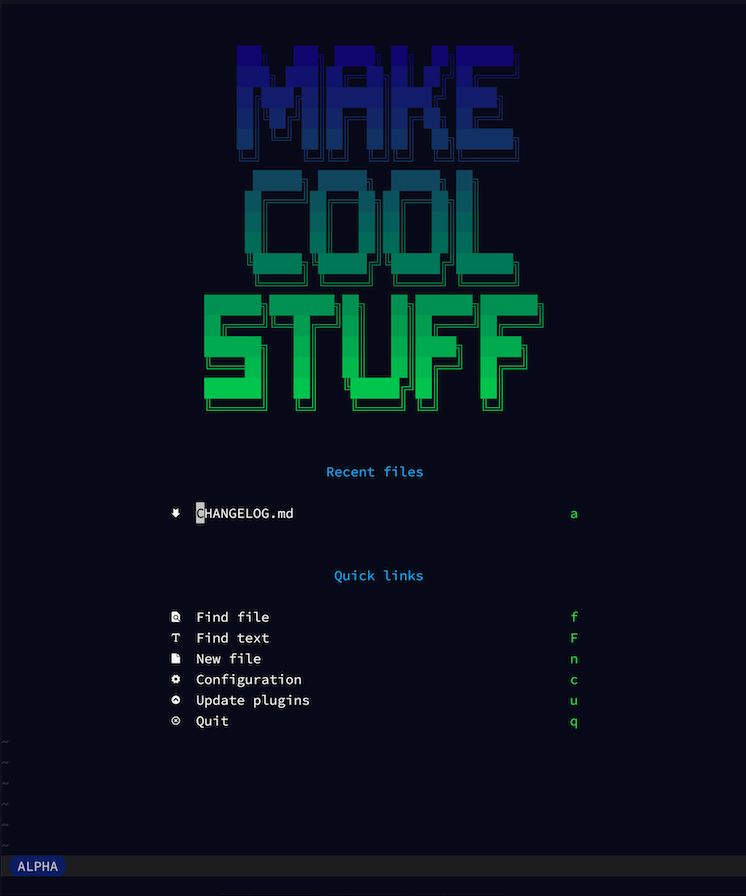

Ad's Neovim Config
==================

A potent Neovim config, enhanced with rich flavours of software development and notable hints of Ruby, JS and Go.



# Installation

```bash
# Clone the repo
git clone -b nvim https://github.com/AdamWhittingham/vim-config.git ~/.config/nvim

# Install everything
cd ~/.config/nvim; ./install
```

> [!NOTE]
> If you haven't moved to Neovim, I've left the `master` branch on the now unmaintained Vim-centric config to avoid breaking anything.
> I'd urge you to switch to Neovim and try the new stuff out, it's fantastic!

## Optional external dependencies for faster
There's a couple of tools that make this config really work well:

1. [Ripgrep](https://github.com/BurntSushi/ripgrep) - search **text** faster
2. [fd](https://github.com/sharkdp/fd) - search **files** faster
3. Running in [WezTerm](https://wezfurlong.org/wezterm/index.html) with a [NerdFont](https://www.nerdfonts.com/) because we deserve pretty things in the terminal.

## Optional Language Server Setup
Neovim is incredibly powerful but can do even more when it has some awareness of the languages you are editing.
To provide Neovim with this context, we need to install some Language Servers. Thankfully this can all be done for us:

- Start nvim and run `:Mason`
- Search for language servers you want and press `i` to install them

# Key Mappings
For the canonical list, see [keymaps.lua](./lua/config/keymaps.lua)
You can also type `:WhichKey` for a helpful list, or pausing in the middle of a sequence will show you the options to complete it.

The `<leader>` key is **Space**.
This is referred to as `<leader>` so that it's easier to read, and will still make sense if you change to a different leader key.

## File & buffer navigation

| Key                        | Function                                                                                |
| -------------------------- | --------------------------------------------------------------------------------------- |
| `<leader> .`               | Show the currently open buffers so you can switch between them                          |
| `<leader><leader>`         | Switch back to the previously open file                                                 |
| `<leader> f`               | Find by **file name**                                                                   |
| `<leader> F`               | Search for text in all files                                                            |
| `:A`                       | Toggle between a file and it's 'alternative' (ie. lib file and its unit test file)      |


## Window navigation

| Key                        | Function                                                                                |
| -------------------------- | --------------------------------------------------------------------------------------- |
| `<Control> h/j/k/l`        | Move cursor to the pane left/up/down/right                                              |
| `<Control>ws`              | Split the current view vertically                                                       |
| `<Control>wS`              | Split the current view horizontally                                                     |
| `:AV`                      | Open the files 'alternative' in a vertical split                                        |


## Changes - Version control

| Key                        | Function                                                                                |
| -------------------------- | --------------------------------------------------------------------------------------- |
| `ca`                       | Add a change to the next commit                                                         |
| `cA`                       | Add all changes to this file to the next commit                                         |
| `cr`                       | Reset the change under the cursor                                                       |
| `]c`                       | Move to the next change in this file                                                    |
| `[c`                       | Move to the previous change in this file                                                |


## Development

| Key                        | Function                                                                                |
| -------------------------- | --------------------------------------------------------------------------------------- |
| `<leader>t`                | Run the current tests                                                                   |
| `<leader>pl`               | Copy the relative path of the current file and line                                     |
| `<leader>pr`               | Copy the relative path of the current file                                              |
| `<leader>]`                | Jump to the definition of the function/class/method under the cursor                    |
| `<leader>}`                | Search for references to the function/class/method under the cursor                     |
| `<leader>{`                | Show the references and definition of the item under the cursor                         |


# Goals and Guides
This project has two goals:

1. Empower me to get more done in my daily work as an engineer.
2. Be an easy starting point for learning Vim. Occasionally, someone I work with wants to learn Vim, so I want this to be useful and slightly familiar starting point until they are ready to build their own config.

## Plugin Guidelines
It's easy to get carried away with every plugin, key binding and option that you see online, so I use the following guiding principles:

1. Plugins aren't inherently evil. I respect people who go the full vim-minimalism route and only use it as it comes out of the box, but it is a tool for a purpose. Anything that give me more context and lets me focus more on the work at hand is a good thing.
2. **Too many** plugins make things slow and can get in the way. I try to only use things that don't cause installation to become complex, or performance to takes a dive. Everything has a cost and needs to earn it's keep.
3. Additional key mappings should be consistent and ideally use an existing mnemonic. For example, `c` is used for version control and diff functions, using the mnemonic "Changes" (e.g. add changes, reset changes).
